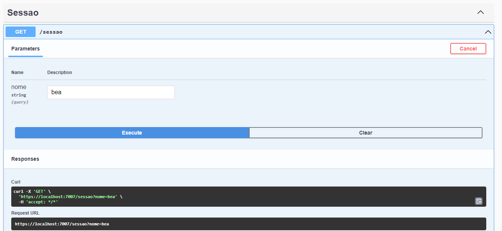

# Sessões

## O que são sessões?

Tendo em vista duas aplicações Cliente e Servidor que se comunicam através do protocolo HTTP e sabendo que este não mantém estado, a utilização de sessões são uma forma de armazenar os dados voláteis sobre o acesso de um usuário.

Uma sessão é criada a partir de uma combinação de usuário e navegador, cada uma é identificada por um id de sessão que é mandado para o front que o armazena em um cookie e o utiliza para enviar a cada requisição que faz para o back, desta forma a aplicação do lado servidor é capaz de recuperar os dados da sessão.

## Como utilizar sessões no Asp.Net Core

Quando criamos um projeto de API ou MVC com asp.net core temos acesso à propriedade HttpContext que guarda todas as informações sobre o acesso que está sendo feito como dados sobre: Session, Request, Response entre outros.

Porém para persistir dados na Session é preciso habilitar a sua aplicação para que guarde sessão através do uso de cache distribuído e utilizando a DI e o middleware de sessão.

Adicionando as configurações do cache distribuído nesse caso será usado o redis. Para utilizar esse metodos de extensão `AddStackExchangeRedisCache()` precisamos adicionar o pacote `Microsoft.Extensions.Caching.StackExchangeRedis`

```jsx
builder.Services.AddStackExchangeRedisCache(opt =>
{
    opt.ConfigurationOptions = new ConfigurationOptions {
        EndPoints = { "localhost" },
        Password = "teste",
        User = "beatriz" 
    };
    opt.InstanceName = "CacheDistributed";
});
```

Adicionando configurações sobre a sessão

```jsx
builder.Services.AddSession(options =>
{
    options.IdleTimeout = TimeSpan.FromSeconds(10);
    options.Cookie.HttpOnly = true;
    options.Cookie.IsEssential = true;
});
```

Adicionando o middleware de sessão à pipeline do app.

Obs.: Deve estar nesta ordem de chamada antes de `MapControllers()`

```jsx
app.UseHttpsRedirection();

app.UseAuthorization();
app.UseSession();
app.MapControllers();

app.Run();
```

Após isso podemos utilizar o `HttpContext.Session`. Código do `SessaoController.cs`

```jsx
[ApiController]
    [Route("sessao")]
    public class SessaoController : ControllerBase
    {
        [HttpGet]
        public IActionResult SetSession ([FromQuery] string nome)
        {
            HttpContext.Session.Set("nome", Encoding.UTF8.GetBytes(nome));
            
            return Ok();
        }

       [HttpGet("listar")]
       public IActionResult GetSession ()
        {
           var n = Encoding.UTF8.GetString(HttpContext.Session.Get("nome") ?? new byte[0]);
            return Ok(new { nome = n });
        }

    }
```

## Aplicação funcionando

Adicionando um valor à sessão



Consultando o valor na sessão

